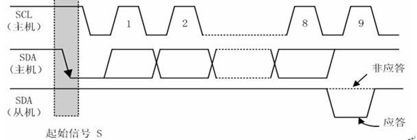

# 基于FPGAO的VR眼镜使用及场景搭建

通过fpga的开发板和mpu6050姿态控制芯片进行IIC通信，然后再通过串口通信将mpu6050读出的信息发送给电脑的串口。最后通过unity脚本读出串口信息获取当前芯片姿态来实现人机交互，最后将设计好的unity场景投屏到手机上再将手机投屏放入VR眼镜中完成设计。

## 项目分工

PB20061229吕泽龙：主要负责verilog部分代码，实现IIC协议的状态机和串口通信，并调试串口，在unity脚本中读取串口信息。

xyc：

## 项目框架

## IIC协议

### 技术性能

时钟频率：100K到400K，本次采取200K

双线架构：SDA和SCL串行总线

唯一地址，独立电源

### 工作原理

#### 起止状态

当SCL为高时，SDA下跳为起始信号，上跳为停止信号。

#### 发送从机地址

7位为地址码，1位为读/写控制位,R/W位为0表示写数据，R/W为1表示读数据

被控器件检测到收到的地址与自己的地址相同时，在第9个时钟期间反馈应答信号

#### 读通信过程

1. 主控在检测到总线空闲的状况下，首先发送一个START信号掌管总线；
2. 发送一个地址字节(包括7位地址码和一位R/W，最后1bit为0，表示写)，将地址写入地址计数器；
3. 当被控器件检测到主控发送的地址与自己的地址相同时发送一个应答信号(ACK)；
4. 主控收到ACK后紧接着发送一个start状态，然后重复第一个地址字节（device code）最后1bit为'1'，代表读。
5. 释放数据总线，开始接收第一个数据字节；
6. 主控收到数据后发送ACK表示继续传送数据，发送NACK表示传送数据结束；

#### 总线信号时序分析

1. 总线空闲状态

SDA和SCL两条信号线都处于高电平，即总线上所有的器件都释放总线，两条信号线各自的上拉电阻把电平拉高；

2. 启动信号START

时钟信号SCL保持高电平，**数据信号SDA的电平被拉低**(即负跳变)。启动信号必须是跳变信号，而且在**建立该信号前必修保证总线处于空闲状态**；

3. 停止信号STOP

时钟信号SCL保持高电平，数据线被释放，使得SDA返回高电平(即正跳变)，停止信号也必须是跳变信号。

4. 数据传送

**SCL线呈现高电平期间，SDA线上的电平必须保持稳定**，低电平表示0(此时的线电压为地电压)，高电平表示1(此时的电压由元器件的VDD决定)。只有在SCL线为低电平期间，SDA上的电平允许变化。

5. 应答信号ACK

I2C总线的数据都是以字节(8位)的方式传送的，发送器件每发送一个字节之后，在时钟的第9个脉冲期间释放数据总线，由接收器发送一个ACK(把数据总线的电平拉低)来表示数据成功接收。

6. 无应答信号NACK

在时钟的第9个脉冲期间发送器释放数据总线，接收器不拉低数据总线表示一个NACK，NACK有两种用途:

a. 一般表示接收器未成功接收数据字节；

b. 当接收器是主控器时，它收到最后一个字节后，应发送一个NACK信号，以通知被控发送器结束数据发送，并释放总线，以便主控接收器发送一个停止信号STOP。

## mpu6050

以数字输出6轴或9轴的旋转矩阵、四元数(quaternion)、欧拉角格式(Euler Angle forma)的融合演算数据。

### 引脚

| 管脚 | 名称    | 说明         |
| ---- | ------- | ------------ |
| VCC  | 3.3-5V  | 内有稳压芯片 |
| GND  | 地线    |              |
| SCL  | MPU6050 | 从机时钟线   |
| SDA  | MPU6050 | 从机数据线   |

### 使用方式

根据之前的IIC协议，可以得到如上的工作流程。

而mpu6050在写入数据地址之后还需要对该寄存器进行初始化的配置，所以实际的流程是

| S\|AD+W | RA   | CONFIG | S\|AD+R   | STOP |      |
| ------- | ---- | ------ | --------- | ---- | ---: |
| ACK     | ACK  | ACK    | ACK\|DATA | ACK4 |      |

### 寄存器位置

~~~verilog

`define MPU_ADDR	0X68
//如果AD0脚(9脚)接地,IIC地址为0X68(不包含最低位).
//如果接V3.3,则IIC地址为0X69(不包含最低位).
`define DEVICE_READ 8'hD1//寻址器件，读操作  
`define DEVICE_WRITE 8'hD0//寻址器件，写操作  
`define ACC_XH 8'h3B//加速度x轴高位地址  
`define ACC_XL 8'h3C//加速度x轴低位地址  
`define ACC_YH 8'h3D//加速度y轴高位地址  
`define ACC_YL 8'h3E//加速度y轴低位地址  
`define ACC_ZH 8'h3F//加速度z轴高位地址  
`define ACC_ZL 8'h40//加速度z轴低位地址  
`define GYRO_XH 8'h43//陀螺仪x轴高位地址  
`define GYRO_XL 8'h44//陀螺仪x轴低位地址  
`define GYRO_YH 8'h45//陀螺仪y轴高位地址  
`define GYRO_YL 8'h46//陀螺仪y轴低位地址  
`define GYRO_ZH 8'h47//陀螺仪z轴高位地址  
`define GYRO_ZL 8'h48//陀螺仪z轴低位地址      
  
//陀螺仪初始化寄存器  
`define PWR_MGMT_1 8'h6B  //电源管理寄存器1
`define SMPLRT_DIV 8'h19  //采样频率分频器
`define CONFIG1 8'h1A  //配置寄存器
`define GYRO_CONFIG 8'h1B  //陀螺仪配置寄存器
`define ACC_CONFIG 8'h1C  //加速度计配置寄存器
//陀螺仪初始化对应寄存器值配置  
`define PWR_MGMT_1_INIT 8'h80 //复位MPU6050
`define PWR_MGMT_1_VAL 8'h00  
`define SMPLRT_DIV_VAL 8'h07  
`define CONFIG1_VAL 8'h06  
`define GYRO_CONFIG_VAL 8'h18  
`define ACC_CONFIG_VAL 8'h01  
~~~

如上图，是根据数据手册得到的对应的数据所在寄存器的位置。

### 状态机设计

~~~verilog
//状态机定义
parameter IDLE = 4'd0;  
parameter START1 = 4'd1;   
parameter ADD1 = 4'd2;  
parameter ACK1 = 4'd3;  
parameter ADD2 = 4'd4;  
parameter ACK2 = 4'd5;  
parameter START2 = 4'd6;  
parameter ADD3 =4'd7;  
parameter ACK3 = 4'd8;  
parameter DATA = 4'd9;  
parameter ACK4 = 4'd10;  
parameter STOP1 = 4'd11;  
parameter STOP2 = 4'd12;  
parameter ADD_EXT = 4'd13;  
parameter ACK_EXT = 4'd14;  
~~~

根据之前的使用方式设计出了如上状态，其中STOP2是为了隔10ms重新采样，IDLE是进入STOP之前的一些初始配置。

#### 复位

~~~verilog
if(!rst_n)  
    begin  
        state <= IDLE;  
        sda_r <= 1'b1;//拉高数据线  
        sda_link <= 1'b0;//高阻态  
        num <= 4'd0;  
        //初始化寄存器  
        ACC_XH_READ <= 8'h00;  
        ...
        times <= 5'b0;  
    end  
~~~

sda采用双线的inout三态门结构，因此sda_link用于设置输入输出模式，当sda_link为高阻态1是sda设置为高阻态输入模式，否则为输出模式。

~~~verilog
assign sda = sda_link?sda_r:1'bz;  
~~~

而读取数据方式采取时分复用的方式，因此times表示当前读取的是哪一个数据位。

#### 等待状态

~~~verilog
IDLE: begin  
    times <= times+1'b1;  
    sda_link <= 1'b1;//sda为输出  
    sda_r <= 1'b1;//拉高sda  
    db_r <= `DEVICE_WRITE;//向从机写入数据地址  
    state = START1;  
end  
~~~

其实这个状态更应该描述为一个时序流程的开始，首先times决定当前读取的数据位，其次将数据寄存器db_r中写入从机地址，做好流程准备。

#### 起始位

~~~verilog
START1:begin//IIC开始 
    if(`SCL_HIG)//scl为高电平  
        begin  
            sda_link <= 1'b1;//sda输出  
            sda_r <= 1'b0;//拉低sda，产生start信号  
            state <= ADD1;  
            num <= 4'd0;  
        end  
    else  
        state <= START1;  
end  
~~~

主要是拉低电平并转到下一状态，num用于计算当前经过了多少个时钟周期。

#### 数据写入与应答

将db_r的数据写入，并在写入完成后等待ACK响应，响应完成后根据times决定好下一次输入的数据是什么。

~~~verilog
ADD1: begin//数据写入  
    if(`SCL_LOW)//scl为低电平  
        begin  
            if(num == 4'd8)//当8位全部输出  
                begin  
                    num <= 4'd0;//计数清零  
                    sda_r <= 1'b1;  
                    sda_link <= 1'b0;//sda高阻态  
                    state <= ACK1;  
                end  
            else  
                begin  
                    state <= ADD1;  
                    num <= num+1'b1;  
                    sda_r <= db_r[4'd7-num];//按位输出  
                end  
        end  
    else  
        state <= ADD1;  
end  
ACK1: begin//应答  
    if(`SCL_NEG)  
        begin  
            state <= ADD2;  
            case(times)//选择下一个写入寄存器地址  
                5'd1: db_r <= `PWR_MGMT_1;  
                ...
                5'd5: db_r <= `ACC_CONFIG;  
                5'd6: db_r <= `ACC_XH;  
                ...
                default: begin  
                    db_r <= `PWR_MGMT_1;  
                    times <= 5'd1;  
                end  
            endcase  
        end  
    else  
        state <= ACK1;//等待响应  
end  
~~~

其余的模式诸如ADD_EXT,ACK_EXT,START2都和上述模式差不多，只不过写入的数据和ACK响应时做的准备不太一样，就不再详细描述。

#### 数据读取

读取的流程和写入差不多，只不过原本是把db_r输出到sda，现在变成存入对应的寄存器中罢了。

~~~verilog
DATA: begin  
    if(num <= 4'd7)  
        begin  
            state <= DATA;  
            if(`SCL_HIG)  
                begin  
                    num <= num+1'b1;  
                    case(times)  
                        5'd6: ACC_XH_READ[4'd7-num] <= sda;  						...
                        5'd17: GYRO_ZL_READ[4'd7-num]<=sda;
                        default: ;//暂时未考虑，可添加代码提高系统稳定性  
                    endcase  
                end  
        end  
    else if((`SCL_LOW)&&(num == 4'd8))  
        begin  
            sda_link <= 1'b1;//sda为输出  
            num <= 4'd0;//计数清零  
            state <= ACK4;  
        end  
    else  
        state <= DATA;  
end  
ACK4: begin  
    if(times == 5'd17)  
        times <= 5'd0;  
    if(`SCL_NEG)  
        begin  
            sda_r <= 1'b1;//拉高sda  
            state <= STOP1;  
        end  
    else  
        state <= ACK4;//等待响应  
end  
~~~

#### 停止

控制好scl，sda电平，并进入下一个循环流程。

~~~verilog

STOP1:begin  
    if(`SCL_LOW)//scl为低  
        begin  
            sda_link <= 1'b1;//sda输出  
            sda_r <= 1'b0;//拉低sda  
            state <= STOP1;  
        end  
    else if(`SCL_HIG)//sda为高  
        begin  
            sda_r <= 1'b1;//拉高sda,产生stop信号  
            state <= STOP2;  
        end  
    else  
        state <= STOP1;  
end  
STOP2:begin  
    if(`SCL_LOW)  
        sda_r <= 1'b1;  
    else if(cnt_10ms == 20'hffff0)//约10ms得一个数据  
        state <= IDLE;  
    else  
        state <= STOP2;  
end  
default:state <= IDLE;  
~~~

## 串口通信

我们已经通过上面的方法将mpu6050芯片成功和fpga通信，现在只需要读出fpga里的信息即可，采取串口通信的方法。

### 工作原理

### 接收数据

板载主时钟为100MHz，因此串行数据波特率为115200时，每个位持续约868个周期，我们用分频计数器进行计数，当接收信号为0时（起始位），分频计数器开始计数，计数值达到433时（起始位中间时刻），状态机从空闲状态跳转到接收状态，分频计数器在0~867循环计数，同时用位计数器进行位计数，可以看出当分频计数器值为“867”时，对应的就是串行接收信号对应位的最佳采样时刻（处于该位的中间时刻），通过位采样信号接收1bit的数据，保存到输出数据（8bit）的对应位中，在输出使能为高电平时将接收到的整个字节输出出去。

~~~verilog
module rx(
    input               clk,rst_n,
    input               rx,
    output  reg         rx_vld,
    output  reg  [7:0]  rx_data
    );
parameter   DIV_CNT   = 10'd867;
parameter   HDIV_CNT  = 10'd433;
parameter   RX_CNT    = 4'h8;
parameter   C_IDLE    = 1'b0;
parameter   C_RX      = 1'b1;    
reg         curr_state;
reg         next_state;
reg [9:0]   div_cnt;
reg [3:0]   rx_cnt;
reg         rx_reg_0,rx_reg_1,rx_reg_2,rx_reg_3,rx_reg_4,rx_reg_5,rx_reg_6,rx_reg_7;
//reg [7:0]   rx_reg;
wire        rx_pulse;
always@(posedge clk or negedge rst_n)
begin
    if(!rst_n)
        curr_state  <= C_IDLE;
    else
        curr_state  <= next_state;
end    
always@(*)
begin
    case(curr_state)
        C_IDLE:
            if(div_cnt==HDIV_CNT)
                next_state  = C_RX;
            else
                next_state  = C_IDLE;
        C_RX:
            if((div_cnt==DIV_CNT)&&(rx_cnt>=RX_CNT))
                next_state  = C_IDLE;
            else
                next_state  = C_RX;
    endcase
end

always@(posedge clk or negedge rst_n)
begin
    if(!rst_n)
        div_cnt <= 10'h0;
    else if(curr_state == C_IDLE)
    begin
        if(rx==1'b1)
            div_cnt <= 10'h0;
        else if(div_cnt < HDIV_CNT)
            div_cnt <= div_cnt + 10'h1;
        else
            div_cnt <= 10'h0;    
    end
    else if(curr_state == C_RX)
    begin
        if(div_cnt >= DIV_CNT)
            div_cnt <= 10'h0;
        else
            div_cnt <= div_cnt + 10'h1;
    end
end
always@(posedge clk or negedge rst_n)
begin
    if(!rst_n)
        rx_cnt  <= 4'h0;
    else if(curr_state == C_IDLE)
        rx_cnt  <= 4'h0;
    else if((div_cnt == DIV_CNT)&&(rx_cnt<4'hF))
        rx_cnt  <= rx_cnt + 1'b1;      
end
assign rx_pulse = (curr_state==C_RX)&&(div_cnt==DIV_CNT);
always@(posedge clk)
begin
    if(rx_pulse)
    begin
        case(rx_cnt)
            4'h0: rx_reg_0 <= rx;
            ...
            4'h7: rx_reg_7 <= rx;
        endcase
    end
end
always@(posedge clk or negedge rst_n)
begin
    if(!rst_n)
    begin
        rx_vld  <= 1'b0;
        rx_data <= 8'h55;
    end    
    else if((curr_state==C_RX)&&(next_state==C_IDLE))
    begin
        rx_vld  <= 1'b1;
        rx_data <= {rx_reg_7,rx_reg_6,rx_reg_5,rx_reg_4,rx_reg_3,rx_reg_2,rx_reg_1,rx_reg_0};
    end
    else
        rx_vld  <= 1'b0;
end
endmodule

~~~

### 发送数据

和接收数据类似，只不过多设置了一个tx_rd接口，高电平表示当前有数据正在输出。

~~~verilog
module tx(
    input           clk,rst_n,
    output  reg     tx,
    input           tx_ready,
    output  reg     tx_rd,
    input   [7:0]   tx_data
);
parameter   DIV_CNT   = 10'd867;
parameter   HDIV_CNT  = 10'd433;
parameter   TX_CNT    = 4'h9;
parameter   C_IDLE    = 1'b0;
parameter   C_TX      = 1'b1;    
    
reg         curr_state,next_state;    
reg [9:0]   div_cnt;
reg [4:0]   tx_cnt;
reg [7:0]   tx_reg;
always@(posedge clk or negedge rst_n)
begin
    if(!rst_n)
        curr_state  <= C_IDLE;
    else
        curr_state  <= next_state;
end    
always@(*)
begin
    case(curr_state)
        C_IDLE:
            if(tx_ready==1'b1)
                next_state  = C_TX;
            else
                next_state  = C_IDLE;
        C_TX:
            if((div_cnt==DIV_CNT)&&(tx_cnt>=TX_CNT))
                next_state  = C_IDLE;
            else
                next_state  = C_TX;
    endcase
end
always@(posedge clk or negedge rst_n)
begin
    if(!rst_n)
        div_cnt <= 10'h0;
    else if(curr_state==C_TX)
    begin
        if(div_cnt>=DIV_CNT)
            div_cnt <= 10'h0;
        else
            div_cnt <= div_cnt + 10'h1;
    end
    else
        div_cnt <= 10'h0;
end
always@(posedge clk or negedge rst_n)
begin
    if(!rst_n)
        tx_cnt  <= 4'h0;
    else if(curr_state==C_TX)
    begin
        if(div_cnt==DIV_CNT)
            tx_cnt <= tx_cnt + 1'b1;
    end
    else
        tx_cnt <= 4'h0;
end
always@(posedge clk or negedge rst_n)
begin
    if(!rst_n)
        tx_rd   <= 1'b0;
    else if((curr_state==C_IDLE)&&(tx_ready==1'b1))
        tx_rd   <= 1'b1;
    else
        tx_rd   <= 1'b0;
end
always@(posedge clk or negedge rst_n)
begin
    if(!rst_n)
        tx_reg  <= 8'b0;
    else if((curr_state==C_IDLE)&&(tx_ready==1'b1))
        tx_reg  <= tx_data;
end

always@(posedge clk or negedge rst_n)
begin
    if(!rst_n)
        tx  <= 1'b1;
    else if(curr_state==C_IDLE)
        tx  <= 1'b1;
    else if(div_cnt==10'h0)
    begin
        case(tx_cnt)
            4'h0:   tx  <= 1'b0;
            4'h1:   tx  <= tx_reg[0];
            ...
            4'h9:   tx  <= 1'b1;
        endcase
    end
end
endmodule

~~~

## 顶层设计

时分复用地输出两个mpu6050芯片对应串口，以单个0xa起始，4个0xa结束。

~~~verilog
module top(
input clk,rst_n,
inout [1:0]sda,
output [1:0]scl,
input               rx,
output              tx,
output [5:0]led
    );
mpu6050 t1(
.clk(clk),
.rst_n(rst_n),
.scl(scl[0]),
.sda(sda[0]),
.ACC_X(ac_x),
.ACC_Y(ac_y),
.ACC_Z(ac_z),
.GYRO_X(gc_x),
.GYRO_Y(gc_y),
.GYRO_Z(gc_z)
);

mpu6050 t2();
reg [35:0]cnt;
reg [4:0]out_period;
    rx                  rx_inst();
    tx                  tx_inst();
always@(posedge clk)
begin
if(cnt <= 1000000)
    cnt <= cnt + 1;
else
    begin
        cnt <= 0;
        out_period <= out_period + 1;
        if(out_period >= 28)
            out_period <= 0;
    end
end
always@(posedge clk)
begin
    if(tim) 
    begin
        tx_r <= 1;
        case (out_period)
        5'b00000: tx_d <= 8'h0a;
        5'b00001: tx_d <= ac_x[15:8];
            ...
        5'b11001: tx_d <= 8'h0a;
        5'b11010: tx_d <= 8'h0a;
        5'b11011: tx_d <= 8'h0a;
        default tx_d <= 8'h0a;
        endcase
    end
    else 
    begin 
    tx_r <= tx_rd;
    end
end
assign tx_ready = tx_r;
assign tx_data = tx_d;
assign led = {ac_x[7], out_period};
endmodule

~~~

这样就成功地从电脑读取了mpu6050的数据。采样频率为100HZ

### 运行效果

采用串口调试工具得到的数据如下所示。

这组数据是我在水平放置mpu6050的情况下测试的，可以先对数据进行一个简单的测算。根据手册。第一片mpu6050的前6组数据0xFA62，0xFBD8和0x487C是三轴的加速度。事实上，前两个x，y轴的加速度是很小的。而后一组0x487C转换成10进制是18556。根据数据手册，计算方式是，相对来说还是较为准确的。

## 姿态解算

mpu6050有两种方法进行姿态解算，其一是运用内置的DMP运算处理器通过四元数进行解算，但是这种方式需要连接其他的地磁外设，并未采用，我们采取欧拉角的方式尝试进行解算。

注意到mpu6050得到的三轴加速度是重力加速度在以mpu6050的惯性系中的加速分量。因此实际上只需要计算出当前mpu6050的偏角就可以得到加速度了。

姿态解算选用的旋转顺序为**ZYX**，即IMU坐标系初始时刻与大地坐标系重合，然后依次绕自己的Z、Y、X轴进行旋转，这里先自定义一下每次的旋转名称和符号：

- 绕IMU的**Z轴**旋转：**航向角yaw**， 转动 **y** 角度
- 绕IMU的**Y轴**旋转：**俯仰角pitch**，转动 **p** 角度
- 绕IMU的**X轴**旋转：**横滚角row**， 转动 **r** 角度

对应的旋转矩阵如下

则mpu6050的计算方式可以描述为

通过这个方程可以得到r和p

事实上进一步推导可以得到角速度的值，然而，由于实验中灵敏度和采样频率的相关问题，我们尝试直接得到位移数据的方法失败，因此我们的整个项目仅仅根据r和p的角度来对场景中的人物进行控制。