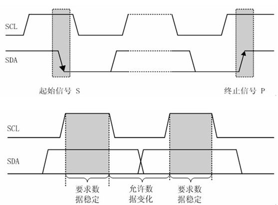

# 基于FPGAO的VR眼镜使用及场景搭建
**视觉特效脚本是环境资源包附带的，不是自己写的也非必要，放到报告里只是为了得到更高的分**

通过fpga的开发板和mpu6050姿态控制芯片进行IIC通信，然后再通过串口通信将mpu6050读出的信息发送给电脑的串口。最后通过unity脚本读出串口信息获取当前芯片姿态来实现人机交互，最后将设计好的unity场景投屏到手机上再将手机投屏放入VR眼镜中完成设计。

## 项目分工

PB20061229吕泽龙：主要负责verilog部分代码，实现IIC协议的状态机和串口通信，并调试串口，在unity脚本中读取串口信息，并辅助调试unity部分。

PB20000156徐亦昶：设计项目，规划硬件、接口连接结构，负责verilog部分的架构设计和辅助调试，以及unity的设计和场景构建。

## 项目框架

## IIC协议

### 技术性能

时钟频率：100K到400K，本次采取200K

双线架构：SDA和SCL串行总线

唯一地址，独立电源

### 工作原理

#### 起止状态

当SCL为高时，SDA下跳为起始信号，上跳为停止信号。



#### 发送从机地址

7位为地址码，1位为读/写控制位,R/W位为0表示写数据，R/W为1表示读数据

被控器件检测到收到的地址与自己的地址相同时，在第9个时钟期间反馈应答信号


#### 读通信过程

1. 主控在检测到总线空闲的状况下，首先发送一个START信号掌管总线；
2. 发送一个地址字节(包括7位地址码和一位R/W，最后1bit为0，表示写)，将地址写入地址计数器；
3. 当被控器件检测到主控发送的地址与自己的地址相同时发送一个应答信号(ACK)；
4. 主控收到ACK后紧接着发送一个start状态，然后重复第一个地址字节（device code）最后1bit为'1'，代表读。
5. 释放数据总线，开始接收第一个数据字节；
6. 主控收到数据后发送ACK表示继续传送数据，发送NACK表示传送数据结束；

#### 总线信号时序分析

1. 总线空闲状态

SDA和SCL两条信号线都处于高电平，即总线上所有的器件都释放总线，两条信号线各自的上拉电阻把电平拉高；

2. 启动信号START

时钟信号SCL保持高电平，**数据信号SDA的电平被拉低**(即负跳变)。启动信号必须是跳变信号，而且在**建立该信号前必修保证总线处于空闲状态**；

3. 停止信号STOP

时钟信号SCL保持高电平，数据线被释放，使得SDA返回高电平(即正跳变)，停止信号也必须是跳变信号。

4. 数据传送

**SCL线呈现高电平期间，SDA线上的电平必须保持稳定**，低电平表示0(此时的线电压为地电压)，高电平表示1(此时的电压由元器件的VDD决定)。只有在SCL线为低电平期间，SDA上的电平允许变化。

5. 应答信号ACK

I2C总线的数据都是以字节(8位)的方式传送的，发送器件每发送一个字节之后，在时钟的第9个脉冲期间释放数据总线，由接收器发送一个ACK(把数据总线的电平拉低)来表示数据成功接收。

6. 无应答信号NACK

在时钟的第9个脉冲期间发送器释放数据总线，接收器不拉低数据总线表示一个NACK，NACK有两种用途:

a. 一般表示接收器未成功接收数据字节；

b. 当接收器是主控器时，它收到最后一个字节后，应发送一个NACK信号，以通知被控发送器结束数据发送，并释放总线，以便主控接收器发送一个停止信号STOP。

## mpu6050

以数字输出6轴或9轴的旋转矩阵、四元数(quaternion)、欧拉角格式(Euler Angle forma)的融合演算数据。

### 引脚

| 管脚 | 名称    | 说明         |
| ---- | ------- | ------------ |
| VCC  | 3.3-5V  | 内有稳压芯片 |
| GND  | 地线    |              |
| SCL  | MPU6050 | 从机时钟线   |
| SDA  | MPU6050 | 从机数据线   |

### 使用方式


根据之前的IIC协议，可以得到如上的工作流程。

而mpu6050在写入数据地址之后还需要对该寄存器进行初始化的配置，所以实际的流程是

| S\|AD+W | RA  | CONFIG | S\|AD+R   | STOP |   |
| ------- | --- | ------ | --------- | ---- | -: |
| ACK     | ACK | ACK    | ACK\|DATA | ACK4 |   |

### 寄存器位置

```verilog

`define MPU_ADDR	0X68
//如果AD0脚(9脚)接地,IIC地址为0X68(不包含最低位).
//如果接V3.3,则IIC地址为0X69(不包含最低位).
`define DEVICE_READ 8'hD1//寻址器件，读操作  
`define DEVICE_WRITE 8'hD0//寻址器件，写操作  
`define ACC_XH 8'h3B//加速度x轴高位地址  
`define ACC_XL 8'h3C//加速度x轴低位地址  
`define ACC_YH 8'h3D//加速度y轴高位地址  
`define ACC_YL 8'h3E//加速度y轴低位地址  
`define ACC_ZH 8'h3F//加速度z轴高位地址  
`define ACC_ZL 8'h40//加速度z轴低位地址  
`define GYRO_XH 8'h43//陀螺仪x轴高位地址  
`define GYRO_XL 8'h44//陀螺仪x轴低位地址  
`define GYRO_YH 8'h45//陀螺仪y轴高位地址  
`define GYRO_YL 8'h46//陀螺仪y轴低位地址  
`define GYRO_ZH 8'h47//陀螺仪z轴高位地址  
`define GYRO_ZL 8'h48//陀螺仪z轴低位地址  
  
//陀螺仪初始化寄存器  
`define PWR_MGMT_1 8'h6B  //电源管理寄存器1
`define SMPLRT_DIV 8'h19  //采样频率分频器
`define CONFIG1 8'h1A  //配置寄存器
`define GYRO_CONFIG 8'h1B  //陀螺仪配置寄存器
`define ACC_CONFIG 8'h1C  //加速度计配置寄存器
//陀螺仪初始化对应寄存器值配置  
`define PWR_MGMT_1_INIT 8'h80 //复位MPU6050
`define PWR_MGMT_1_VAL 8'h00  
`define SMPLRT_DIV_VAL 8'h07  
`define CONFIG1_VAL 8'h06  
`define GYRO_CONFIG_VAL 8'h18  
`define ACC_CONFIG_VAL 8'h01  
```

如上图，是根据数据手册得到的对应的数据所在寄存器的位置。

### 状态机设计

```verilog
//状态机定义
parameter IDLE = 4'd0;  
parameter START1 = 4'd1;   
parameter ADD1 = 4'd2;  
parameter ACK1 = 4'd3;  
parameter ADD2 = 4'd4;  
parameter ACK2 = 4'd5;  
parameter START2 = 4'd6;  
parameter ADD3 =4'd7;  
parameter ACK3 = 4'd8;  
parameter DATA = 4'd9;  
parameter ACK4 = 4'd10;  
parameter STOP1 = 4'd11;  
parameter STOP2 = 4'd12;  
parameter ADD_EXT = 4'd13;  
parameter ACK_EXT = 4'd14;  
```

根据之前的使用方式设计出了如上状态，其中STOP2是为了隔10ms重新采样，IDLE是进入STOP之前的一些初始配置。

#### 复位

```verilog
if(!rst_n)  
    begin  
        state <= IDLE;  
        sda_r <= 1'b1;//拉高数据线  
        sda_link <= 1'b0;//高阻态  
        num <= 4'd0;  
        //初始化寄存器  
        ACC_XH_READ <= 8'h00;  
        ...
        times <= 5'b0;  
    end  
```

sda采用双线的inout三态门结构，因此sda_link用于设置输入输出模式，当sda_link为高阻态1是sda设置为高阻态输入模式，否则为输出模式。

```verilog
assign sda = sda_link?sda_r:1'bz;  
```

而读取数据方式采取时分复用的方式，因此times表示当前读取的是哪一个数据位。

#### 等待状态

```verilog
IDLE: begin  
    times <= times+1'b1;  
    sda_link <= 1'b1;//sda为输出  
    sda_r <= 1'b1;//拉高sda  
    db_r <= `DEVICE_WRITE;//向从机写入数据地址  
    state = START1;  
end  
```

其实这个状态更应该描述为一个时序流程的开始，首先times决定当前读取的数据位，其次将数据寄存器db_r中写入从机地址，做好流程准备。

#### 起始位

```verilog
START1:begin//IIC开始 
    if(`SCL_HIG)//scl为高电平  
        begin  
            sda_link <= 1'b1;//sda输出  
            sda_r <= 1'b0;//拉低sda，产生start信号  
            state <= ADD1;  
            num <= 4'd0;  
        end  
    else  
        state <= START1;  
end  
```

主要是拉低电平并转到下一状态，num用于计算当前经过了多少个时钟周期。

#### 数据写入与应答

将db_r的数据写入，并在写入完成后等待ACK响应，响应完成后根据times决定好下一次输入的数据是什么。

```verilog
ADD1: begin//数据写入  
    if(`SCL_LOW)//scl为低电平  
        begin  
            if(num == 4'd8)//当8位全部输出  
                begin  
                    num <= 4'd0;//计数清零  
                    sda_r <= 1'b1;  
                    sda_link <= 1'b0;//sda高阻态  
                    state <= ACK1;  
                end  
            else  
                begin  
                    state <= ADD1;  
                    num <= num+1'b1;  
                    sda_r <= db_r[4'd7-num];//按位输出  
                end  
        end  
    else  
        state <= ADD1;  
end  
ACK1: begin//应答  
    if(`SCL_NEG)  
        begin  
            state <= ADD2;  
            case(times)//选择下一个写入寄存器地址  
                5'd1: db_r <= `PWR_MGMT_1;  
                ...
                5'd5: db_r <= `ACC_CONFIG;  
                5'd6: db_r <= `ACC_XH;  
                ...
                default: begin  
                    db_r <= `PWR_MGMT_1;  
                    times <= 5'd1;  
                end  
            endcase  
        end  
    else  
        state <= ACK1;//等待响应  
end  
```

其余的模式诸如ADD_EXT,ACK_EXT,START2都和上述模式差不多，只不过写入的数据和ACK响应时做的准备不太一样，就不再详细描述。

#### 数据读取

读取的流程和写入差不多，只不过原本是把db_r输出到sda，现在变成存入对应的寄存器中罢了。

```verilog
DATA: begin  
    if(num <= 4'd7)  
        begin  
            state <= DATA;  
            if(`SCL_HIG)  
                begin  
                    num <= num+1'b1;  
                    case(times)  
                        5'd6: ACC_XH_READ[4'd7-num] <= sda;  						...
                        5'd17: GYRO_ZL_READ[4'd7-num]<=sda;
                        default: ;//暂时未考虑，可添加代码提高系统稳定性  
                    endcase  
                end  
        end  
    else if((`SCL_LOW)&&(num == 4'd8))  
        begin  
            sda_link <= 1'b1;//sda为输出  
            num <= 4'd0;//计数清零  
            state <= ACK4;  
        end  
    else  
        state <= DATA;  
end  
ACK4: begin  
    if(times == 5'd17)  
        times <= 5'd0;  
    if(`SCL_NEG)  
        begin  
            sda_r <= 1'b1;//拉高sda  
            state <= STOP1;  
        end  
    else  
        state <= ACK4;//等待响应  
end  
```

#### 停止

控制好scl，sda电平，并进入下一个循环流程。

```verilog

STOP1:begin  
    if(`SCL_LOW)//scl为低  
        begin  
            sda_link <= 1'b1;//sda输出  
            sda_r <= 1'b0;//拉低sda  
            state <= STOP1;  
        end  
    else if(`SCL_HIG)//sda为高  
        begin  
            sda_r <= 1'b1;//拉高sda,产生stop信号  
            state <= STOP2;  
        end  
    else  
        state <= STOP1;  
end  
STOP2:begin  
    if(`SCL_LOW)  
        sda_r <= 1'b1;  
    else if(cnt_10ms == 20'hffff0)//约10ms得一个数据  
        state <= IDLE;  
    else  
        state <= STOP2;  
end  
default:state <= IDLE;  
```

## 串口通信

我们已经通过上面的方法将mpu6050芯片成功和fpga通信，现在只需要读出fpga里的信息即可，采取串口通信的方法。

### 工作原理


### 接收数据

板载主时钟为100MHz，因此串行数据波特率为115200时，每个位持续约868个周期，我们用分频计数器进行计数，当接收信号为0时（起始位），分频计数器开始计数，计数值达到433时（起始位中间时刻），状态机从空闲状态跳转到接收状态，分频计数器在0~867循环计数，同时用位计数器进行位计数，可以看出当分频计数器值为“867”时，对应的就是串行接收信号对应位的最佳采样时刻（处于该位的中间时刻），通过位采样信号接收1bit的数据，保存到输出数据（8bit）的对应位中，在输出使能为高电平时将接收到的整个字节输出出去。

```verilog
module rx(
    input               clk,rst_n,
    input               rx,
    output  reg         rx_vld,
    output  reg  [7:0]  rx_data
    );
parameter   DIV_CNT   = 10'd867;
parameter   HDIV_CNT  = 10'd433;
parameter   RX_CNT    = 4'h8;
parameter   C_IDLE    = 1'b0;
parameter   C_RX      = 1'b1;  
reg         curr_state;
reg         next_state;
reg [9:0]   div_cnt;
reg [3:0]   rx_cnt;
reg         rx_reg_0,rx_reg_1,rx_reg_2,rx_reg_3,rx_reg_4,rx_reg_5,rx_reg_6,rx_reg_7;
//reg [7:0]   rx_reg;
wire        rx_pulse;
always@(posedge clk or negedge rst_n)
begin
    if(!rst_n)
        curr_state  <= C_IDLE;
    else
        curr_state  <= next_state;
end  
always@(*)
begin
    case(curr_state)
        C_IDLE:
            if(div_cnt==HDIV_CNT)
                next_state  = C_RX;
            else
                next_state  = C_IDLE;
        C_RX:
            if((div_cnt==DIV_CNT)&&(rx_cnt>=RX_CNT))
                next_state  = C_IDLE;
            else
                next_state  = C_RX;
    endcase
end

always@(posedge clk or negedge rst_n)
begin
    if(!rst_n)
        div_cnt <= 10'h0;
    else if(curr_state == C_IDLE)
    begin
        if(rx==1'b1)
            div_cnt <= 10'h0;
        else if(div_cnt < HDIV_CNT)
            div_cnt <= div_cnt + 10'h1;
        else
            div_cnt <= 10'h0;  
    end
    else if(curr_state == C_RX)
    begin
        if(div_cnt >= DIV_CNT)
            div_cnt <= 10'h0;
        else
            div_cnt <= div_cnt + 10'h1;
    end
end
always@(posedge clk or negedge rst_n)
begin
    if(!rst_n)
        rx_cnt  <= 4'h0;
    else if(curr_state == C_IDLE)
        rx_cnt  <= 4'h0;
    else if((div_cnt == DIV_CNT)&&(rx_cnt<4'hF))
        rx_cnt  <= rx_cnt + 1'b1;  
end
assign rx_pulse = (curr_state==C_RX)&&(div_cnt==DIV_CNT);
always@(posedge clk)
begin
    if(rx_pulse)
    begin
        case(rx_cnt)
            4'h0: rx_reg_0 <= rx;
            ...
            4'h7: rx_reg_7 <= rx;
        endcase
    end
end
always@(posedge clk or negedge rst_n)
begin
    if(!rst_n)
    begin
        rx_vld  <= 1'b0;
        rx_data <= 8'h55;
    end  
    else if((curr_state==C_RX)&&(next_state==C_IDLE))
    begin
        rx_vld  <= 1'b1;
        rx_data <= {rx_reg_7,rx_reg_6,rx_reg_5,rx_reg_4,rx_reg_3,rx_reg_2,rx_reg_1,rx_reg_0};
    end
    else
        rx_vld  <= 1'b0;
end
endmodule

```

### 发送数据

和接收数据类似，只不过多设置了一个tx_rd接口，高电平表示当前有数据正在输出。

```verilog
module tx(
    input           clk,rst_n,
    output  reg     tx,
    input           tx_ready,
    output  reg     tx_rd,
    input   [7:0]   tx_data
);
parameter   DIV_CNT   = 10'd867;
parameter   HDIV_CNT  = 10'd433;
parameter   TX_CNT    = 4'h9;
parameter   C_IDLE    = 1'b0;
parameter   C_TX      = 1'b1;  
  
reg         curr_state,next_state;  
reg [9:0]   div_cnt;
reg [4:0]   tx_cnt;
reg [7:0]   tx_reg;
always@(posedge clk or negedge rst_n)
begin
    if(!rst_n)
        curr_state  <= C_IDLE;
    else
        curr_state  <= next_state;
end  
always@(*)
begin
    case(curr_state)
        C_IDLE:
            if(tx_ready==1'b1)
                next_state  = C_TX;
            else
                next_state  = C_IDLE;
        C_TX:
            if((div_cnt==DIV_CNT)&&(tx_cnt>=TX_CNT))
                next_state  = C_IDLE;
            else
                next_state  = C_TX;
    endcase
end
always@(posedge clk or negedge rst_n)
begin
    if(!rst_n)
        div_cnt <= 10'h0;
    else if(curr_state==C_TX)
    begin
        if(div_cnt>=DIV_CNT)
            div_cnt <= 10'h0;
        else
            div_cnt <= div_cnt + 10'h1;
    end
    else
        div_cnt <= 10'h0;
end
always@(posedge clk or negedge rst_n)
begin
    if(!rst_n)
        tx_cnt  <= 4'h0;
    else if(curr_state==C_TX)
    begin
        if(div_cnt==DIV_CNT)
            tx_cnt <= tx_cnt + 1'b1;
    end
    else
        tx_cnt <= 4'h0;
end
always@(posedge clk or negedge rst_n)
begin
    if(!rst_n)
        tx_rd   <= 1'b0;
    else if((curr_state==C_IDLE)&&(tx_ready==1'b1))
        tx_rd   <= 1'b1;
    else
        tx_rd   <= 1'b0;
end
always@(posedge clk or negedge rst_n)
begin
    if(!rst_n)
        tx_reg  <= 8'b0;
    else if((curr_state==C_IDLE)&&(tx_ready==1'b1))
        tx_reg  <= tx_data;
end

always@(posedge clk or negedge rst_n)
begin
    if(!rst_n)
        tx  <= 1'b1;
    else if(curr_state==C_IDLE)
        tx  <= 1'b1;
    else if(div_cnt==10'h0)
    begin
        case(tx_cnt)
            4'h0:   tx  <= 1'b0;
            4'h1:   tx  <= tx_reg[0];
            ...
            4'h9:   tx  <= 1'b1;
        endcase
    end
end
endmodule

```

## 顶层设计

时分复用地输出两个mpu6050芯片对应串口，以单个0xa起始，4个0xa结束。

```verilog
module top(
input clk,rst_n,
inout [1:0]sda,
output [1:0]scl,
input               rx,
output              tx,
output [5:0]led
    );
mpu6050 t1(
.clk(clk),
.rst_n(rst_n),
.scl(scl[0]),
.sda(sda[0]),
.ACC_X(ac_x),
.ACC_Y(ac_y),
.ACC_Z(ac_z),
.GYRO_X(gc_x),
.GYRO_Y(gc_y),
.GYRO_Z(gc_z)
);

mpu6050 t2();
reg [35:0]cnt;
reg [4:0]out_period;
    rx                  rx_inst();
    tx                  tx_inst();
always@(posedge clk)
begin
if(cnt <= 1000000)
    cnt <= cnt + 1;
else
    begin
        cnt <= 0;
        out_period <= out_period + 1;
        if(out_period >= 28)
            out_period <= 0;
    end
end
always@(posedge clk)
begin
    if(tim) 
    begin
        tx_r <= 1;
        case (out_period)
        5'b00000: tx_d <= 8'h0a;
        5'b00001: tx_d <= ac_x[15:8];
            ...
        5'b11001: tx_d <= 8'h0a;
        5'b11010: tx_d <= 8'h0a;
        5'b11011: tx_d <= 8'h0a;
        default tx_d <= 8'h0a;
        endcase
    end
    else 
    begin 
    tx_r <= tx_rd;
    end
end
assign tx_ready = tx_r;
assign tx_data = tx_d;
assign led = {ac_x[7], out_period};
endmodule

```

这样就成功地从电脑读取了mpu6050的数据。采样频率为100HZ

### 运行效果

采用串口调试工具得到的数据如下所示。


这组数据是我在水平放置mpu6050的情况下测试的，可以先对数据进行一个简单的测算。根据手册。第一片mpu6050的前6组数据0xFA62，0xFBD8和0x487C是三轴的加速度。事实上，前两个x，y轴的加速度是很小的。而后一组0x487C转换成10进制是18556。根据数据手册，计算方式是，相对来说还是较为准确的。

## 姿态解算

mpu6050有两种方法进行姿态解算，其一是运用内置的DMP运算处理器通过四元数进行解算，但是这种方式需要连接其他的地磁外设，并未采用，我们采取欧拉角的方式尝试进行解算。

注意到mpu6050得到的三轴加速度是重力加速度在以mpu6050的惯性系中的加速分量。因此实际上只需要计算出当前mpu6050的偏角就可以得到加速度了。

姿态解算选用的旋转顺序为**ZYX**，即IMU坐标系初始时刻与大地坐标系重合，然后依次绕自己的Z、Y、X轴进行旋转，这里先自定义一下每次的旋转名称和符号：

- 绕IMU的**Z轴**旋转：**航向角yaw**， 转动**y** 角度
- 绕IMU的**Y轴**旋转：**俯仰角pitch**，转动**p** 角度
- 绕IMU的**X轴**旋转：**横滚角row**， 转动**r** 角度

对应的旋转矩阵如下


则mpu6050的计算方式可以描述为


通过这个方程可以得到r和p

事实上进一步推导可以得到角速度的值，然而，由于实验中灵敏度和采样频率的相关问题，我们尝试直接得到位移数据的方法失败，因此我们的整个项目仅仅根据r和p的角度来对场景中的人物进行控制。

## Unity部分的开发

### Unity和FPGA通信接口

创建脚本MPU6050.cs，并将其挂到主相机下。该脚本通过串口读取原始数据，并将其保存在全局数组result中，供其他模块读取。

代码如下：

```cs
using System.Collections;
using System.Collections.Generic;
using UnityEngine;
using System.IO.Ports;
using System;

public class MPU6050 : MonoBehaviour
{
    string getPortName;
    int baudRate = 115200;
    private Parity parity = Parity.None;
    private int dataBits = 8;
    private StopBits stopBits = StopBits.One;
    SerialPort sp = null;
    private string testString;
    public int[] result = new int[29];
    private int counter;
    // Use this for initialization
    void Start()
    {
        getPortName = "COM4";
        testString = "b";
        OpenPort(getPortName);
        counter = 0;
        StartCoroutine(DataReceiveFunction());
    }

    public void OpenPort(string DefaultPortName)
    {
        sp = new SerialPort(DefaultPortName, baudRate, parity, dataBits, stopBits);
        sp.ReadTimeout = 10;
        try
        {
            if (!sp.IsOpen)
            {
                sp.Open();
            }
        }
        catch (Exception ex)
        {
            Debug.Log(ex.Message);
        }
    }

    public void ClosePort()
    {
        try
        {
            sp.Close();
        }
        catch (Exception ex)
        {
            Debug.Log(ex.Message);
        }
    }
    IEnumerator DataReceiveFunction()
    {
        byte[] dataBytes = new byte[1024];
        int bytesToRead = 0;

        while (true)
        {
            if (sp != null && sp.IsOpen)
            {
                try
                {
                    bytesToRead = sp.Read(dataBytes, 0, dataBytes.Length);
                    for (int i = 0; i < bytesToRead; ++i)
                    {
                        result[counter++] = dataBytes[i];
                        if (counter == 29) counter = 0;
                    }
                }
                catch (Exception ex)
                {

                }
            }
            yield return new WaitForSeconds(0);
        }
    }
    public void SendSerialPortData(string data)
    {
        if (sp.IsOpen)
        {
            sp.WriteLine(data);
        }
    }
    public void SendString()
    {
        SendSerialPortData("a");
    }
    private void OnApplicationQuit()
    {
        ClosePort();
    }
    private void OnDisable()
    {
        ClosePort();
    }
}
```

程序启动时先执行Start函数，这个函数打开了端口并执行例程DateReceiveFunction()，该例程的执行不影响后面语句的执行（某种意义上可以理解成并行）。在这个函数中，每次接收尽可能多的串口数据，并依次存入数组。事实上byte的1024是远大于实际需求的，这样设计是为了尽可能防止读入过慢造成串口数据缓冲区溢出和游戏延时。

### 数据预处理

ShowInfo.cs处理了这些数据，将数据去除开始和结束标记，提取有效位，随后进行位运算还原出原始的16位数据并将头部和手柄数据信息分别存入数组datahead和datahandle，再提取加速度信息存入公有数组real，供其他模块使用。real的前三个元素是头部信息，后三个元素是手柄信息。

代码如下：

```cs
using System.Collections;
using System.Collections.Generic;
using UnityEngine;
using UnityEngine.UI;
using System;

public class ShowInfo : MonoBehaviour
{
    //public Text Info;
    public int start_pos = -1;
    private float[] bias = new float[6];
    public short[] datahead = new short[6];
    public short[] datahandle = new short[6];
    public float[] real = new float[6];
    public int[] processedhead = new int[12];
    public int[] processedhandle = new int[12];
    // Start is called before the first frame update
    void Start()
    {

    }

    // Update is called once per frame
    void Update()
    {
        int[] result = GameObject.Find("Main Camera").GetComponent<MPU6050>().result;
        if (start_pos == -1)
        {
            start_pos = DetectMode(result);
        }
        else
        {
            int cnt = 0;
            float[] tmp = new float[6];
            for (int i = (start_pos + 5) % 29; i != start_pos; i = (i + 1) % 29)
            {
                if (cnt < 12) processedhead[cnt] = result[i];
                else processedhandle[cnt-12] = result[i];
                cnt++;
            }
            for(int i=0;i<6;i++)
            {
                datahead[i] = (short)((processedhead[2 * i] << 8) + processedhead[2 * i + 1]);
                datahandle[i] = (short)((processedhandle[2 * i] << 8) + processedhandle[2 * i + 1]);
            }
            for (int i = 0; i < 3; i++)
            {
                real[i] = (float)datahead[i];
                real[i + 3] = (float)datahandle[i];
            }
        }
    }
    int DetectMode(int[] arr)
    {
        int ret = -1;
        for (int i = 0; i < 29; i++)
        {
            bool flag = true;
            for (int j = 0; j < 5; j++)
            {
                if (arr[(i + j) % 29] != 10) flag = false;
            }
            if (flag && ret == -1) ret = i;
            else if (flag && ret != -1) ret = -1;
        }
        return ret;
    }
}

```

在最开始的时候，由于不知道读入的数据第一位在哪（程序启动时FPGA可能预先发了好几位数据，导致起始地址并不在result数组的第一位。这时需要使用模式匹配来检测数据的起始地址。循环对数组进行扫描，如果遇到连续的5个0x0A说明这部分是可能的起始结束符。然而为保证数据的可靠性，需要对其余数据也进行检测。如果匹配到的字符串数量多余1，则认为这组数据会造成歧义，不给start_pos赋值，并等待下一次的检测。只有start_pos被正确赋值后，才会进行后面数据的处理工作。start_pos在整个程序生命周期会且只会被赋值一次。

在游戏中创建对象Canvas->Text，并将脚本挂载在这里。事实上，这么做的原因是一开始需要在屏幕上显示处理过的信息以方便调试。

### 摄像机的移动

Move.cs读取ShowInfo.cs的信息并相应地移动摄像机。首先通过重力加速度在MPU6050x和z轴的分量求出头盔和手柄的角度，再将头盔的旋转角直接对应到摄像头的旋转角（只支持左右旋转），将手柄的旋转角线性变换后映射为摄像机的移动速度，从而实现角色在场景中的视角变换和移动。该脚本挂载在摄像机对象Eye中（它的子对象是左右眼两个摄像机）。

代码：

```cs
using System.Collections;
using System.Collections.Generic;
using UnityEngine;

public class Move : MonoBehaviour
{
    public GameObject myHandle;
    public float speed;
    private Rigidbody rig;
    private ShowInfo showinfo;
    // Start is called before the first frame update
    void Start()
    {
        myHandle= GameObject.Find("Handle");
        rig = GetComponent<Rigidbody>();
        showinfo = GameObject.Find("Canvas").GetComponent<ShowInfo>();
    }

    // Update is called once per frame
    void Update()
    {
        float[] real = showinfo.real; //z,-x,y
        float deg = (float)System.Math.Atan(real[0] / real[2])*180/(float)3.1415926 * 2;
        transform.rotation = Quaternion.Slerp(transform.rotation, Quaternion.Euler(0, (int)deg, 0), 0.2f);
        deg = (float)System.Math.Atan(real[3] / real[5]) * 180 / (float)3.1415926;
        speed = deg/3;
        if (!(deg>=0||deg<=0)) speed = 0;
        if (System.Math.Abs(speed) < 2) speed = 0;
        transform.Translate(speed * Time.deltaTime, 0, 0, Space.Self);
        Vector3 pos = transform.position;
        transform.position = pos;
    }
}

```

Update函数是在每一帧开始时执行，在函数中进行了特殊情况的判断：

* 当数据未校正完毕导致deg为NaN时，将其初始化为0.
* 当速度绝对值小于2时强制置0，以实现角色在场景中稳定的静止，防止移动过灵敏。

### 骷髅人相关脚本

Scary.cs负责处理游戏中的特效。当用户与某个骷髅人的距离小于7时，骷髅人有二分之一的概率会突然看向他并发出笑声。在用户移到这个距离之外时，该过程仅会发生一次。用户与骷髅人的距离小于15时，游戏会以2/3的概率发出紧张的音效。在初始化时，每个骷髅人都会随机旋转一个角度。

代码如下：

```cs
using System.Collections;
using System.Collections.Generic;
using UnityEngine;

public class Scare : MonoBehaviour
{
    public GameObject neck;
    public GameObject camera;
    public AudioClip laugh;
    public AudioClip close;
    private AudioSource audioS;
    private AudioSource audioC;
    private int scared = 0;
    private int closed = 0;
    void Start()
    {
        neck = transform.FindChild("Rig/Root/pelvis/spine_01/spine_02/spine_03/neck_01").gameObject;
        camera = GameObject.Find("Eye").gameObject;
        transform.rotation = Quaternion.Slerp(transform.rotation, Quaternion.Euler(0, Random.Range(0,360), 0), 1f);
        audioS = GameObject.Find("Laugh").GetComponent<AudioSource>();
        audioC = GameObject.Find("Close").GetComponent<AudioSource>();
    }

    // Update is called once per frame
    void Update()
    {
        float x1 = camera.transform.position.x;
        float z1 = camera.transform.position.z;
        float x2 = neck.transform.position.x;
        float z2 = neck.transform.position.z;
        int choice = Random.Range(0, 6);
        if (System.Math.Sqrt((x1 - x2) * (x1 - x2) + (z1 - z2) * (z1 - z2)) <= 7 && scared == 0)
        {
            if(choice % 2==0)
            {
                neck.transform.rotation = Quaternion.Slerp(neck.transform.rotation, Quaternion.Euler(31, -90 + (int)(180f * camera.transform.rotation.y), 0), 1f);
                audioS.PlayOneShot(laugh);
            }
            scared = 1;
        }
        else if(System.Math.Sqrt((x1 - x2) * (x1 - x2) + (z1 - z2) * (z1 - z2)) > 7)
            scared = 0;
        if (System.Math.Sqrt((x1 - x2) * (x1 - x2) + (z1 - z2) * (z1 - z2)) <= 15 && closed == 0)
        {
            if (choice % 3 <= 1)
            {
                audioC.PlayOneShot(close);
            }
            closed = 1;
        }
        else if (System.Math.Sqrt((x1 - x2) * (x1 - x2) + (z1 - z2) * (z1 - z2)) > 15)
            closed = 1;
    }
}

```

### 视觉特效脚本

由于不是游戏的主要部分，这里仅展示代码。

GlobalFog.cs：烘托迷雾效果，可以渲染出压抑的氛围。

```cs
using System;
using UnityEngine;

namespace Assets.ImageEffects
{
    [ExecuteInEditMode]
    [RequireComponent (typeof(Camera))]
    [AddComponentMenu ("Image Effects/Rendering/Global Fog")]
    class GlobalFog : PostEffectsBase
	{
		[Tooltip("Apply distance-based fog?")]
        public bool  distanceFog = true;
		[Tooltip("Exclude far plane pixels from distance-based fog? (Skybox or clear color)")]
		public bool  excludeFarPixels = true;
		[Tooltip("Distance fog is based on radial distance from camera when checked")]
		public bool  useRadialDistance = false;
		[Tooltip("Apply height-based fog?")]
		public bool  heightFog = true;
		[Tooltip("Fog top Y coordinate")]
        public float height = 1.0f;
        [Range(0.001f,10.0f)]
        public float heightDensity = 2.0f;
		[Tooltip("Push fog away from the camera by this amount")]
        public float startDistance = 0.0f;

        public Shader fogShader = null;
        private Material fogMaterial = null;


        public override bool CheckResources ()
		{
            CheckSupport (true);

            fogMaterial = CheckShaderAndCreateMaterial (fogShader, fogMaterial);

            if (!isSupported)
                ReportAutoDisable ();
            return isSupported;
        }

        [ImageEffectOpaque]
        void OnRenderImage (RenderTexture source, RenderTexture destination)
		{
            if (CheckResources()==false || (!distanceFog && !heightFog))
            {
                Graphics.Blit (source, destination);
                return;
            }

			Camera cam = GetComponent<Camera>();
			Transform camtr = cam.transform;
			float camNear = cam.nearClipPlane;
			float camFar = cam.farClipPlane;
			float camFov = cam.fieldOfView;
			float camAspect = cam.aspect;

            Matrix4x4 frustumCorners = Matrix4x4.identity;

			float fovWHalf = camFov * 0.5f;

			Vector3 toRight = camtr.right * camNear * Mathf.Tan (fovWHalf * Mathf.Deg2Rad) * camAspect;
			Vector3 toTop = camtr.up * camNear * Mathf.Tan (fovWHalf * Mathf.Deg2Rad);

			Vector3 topLeft = (camtr.forward * camNear - toRight + toTop);
			float camScale = topLeft.magnitude * camFar/camNear;

            topLeft.Normalize();
			topLeft *= camScale;

			Vector3 topRight = (camtr.forward * camNear + toRight + toTop);
            topRight.Normalize();
			topRight *= camScale;

			Vector3 bottomRight = (camtr.forward * camNear + toRight - toTop);
            bottomRight.Normalize();
			bottomRight *= camScale;

			Vector3 bottomLeft = (camtr.forward * camNear - toRight - toTop);
            bottomLeft.Normalize();
			bottomLeft *= camScale;

            frustumCorners.SetRow (0, topLeft);
            frustumCorners.SetRow (1, topRight);
            frustumCorners.SetRow (2, bottomRight);
            frustumCorners.SetRow (3, bottomLeft);

			var camPos= camtr.position;
            float FdotC = camPos.y-height;
            float paramK = (FdotC <= 0.0f ? 1.0f : 0.0f);
            float excludeDepth = (excludeFarPixels ? 1.0f : 2.0f);
            fogMaterial.SetMatrix ("_FrustumCornersWS", frustumCorners);
            fogMaterial.SetVector ("_CameraWS", camPos);
            fogMaterial.SetVector ("_HeightParams", new Vector4 (height, FdotC, paramK, heightDensity*0.5f));
            fogMaterial.SetVector ("_DistanceParams", new Vector4 (-Mathf.Max(startDistance,0.0f), excludeDepth, 0, 0));

            var sceneMode= RenderSettings.fogMode;
            var sceneDensity= RenderSettings.fogDensity;
            var sceneStart= RenderSettings.fogStartDistance;
            var sceneEnd= RenderSettings.fogEndDistance;
            Vector4 sceneParams;
            bool  linear = (sceneMode == FogMode.Linear);
            float diff = linear ? sceneEnd - sceneStart : 0.0f;
            float invDiff = Mathf.Abs(diff) > 0.0001f ? 1.0f / diff : 0.0f;
            sceneParams.x = sceneDensity * 1.2011224087f; // density / sqrt(ln(2)), used by Exp2 fog mode
            sceneParams.y = sceneDensity * 1.4426950408f; // density / ln(2), used by Exp fog mode
            sceneParams.z = linear ? -invDiff : 0.0f;
            sceneParams.w = linear ? sceneEnd * invDiff : 0.0f;
            fogMaterial.SetVector ("_SceneFogParams", sceneParams);
			fogMaterial.SetVector ("_SceneFogMode", new Vector4((int)sceneMode, useRadialDistance ? 1 : 0, 0, 0));

            int pass = 0;
            if (distanceFog && heightFog)
                pass = 0; // distance + height
            else if (distanceFog)
                pass = 1; // distance only
            else
                pass = 2; // height only
            CustomGraphicsBlit (source, destination, fogMaterial, pass);
        }

        static void CustomGraphicsBlit (RenderTexture source, RenderTexture dest, Material fxMaterial, int passNr)
		{
            RenderTexture.active = dest;

            fxMaterial.SetTexture ("_MainTex", source);

            GL.PushMatrix ();
            GL.LoadOrtho ();

            fxMaterial.SetPass (passNr);

            GL.Begin (GL.QUADS);

            GL.MultiTexCoord2 (0, 0.0f, 0.0f);
            GL.Vertex3 (0.0f, 0.0f, 3.0f); // BL

            GL.MultiTexCoord2 (0, 1.0f, 0.0f);
            GL.Vertex3 (1.0f, 0.0f, 2.0f); // BR

            GL.MultiTexCoord2 (0, 1.0f, 1.0f);
            GL.Vertex3 (1.0f, 1.0f, 1.0f); // TR

            GL.MultiTexCoord2 (0, 0.0f, 1.0f);
            GL.Vertex3 (0.0f, 1.0f, 0.0f); // TL

            GL.End ();
            GL.PopMatrix ();
        }
    }
}

```

SunShafts.cs：太阳光照细节，可以突出太阳光带来的模糊等效果，使体验更真实。

```cs
using System;
using UnityEngine;

namespace Assets.ImageEffects
{
    [ExecuteInEditMode]
    [RequireComponent (typeof(Camera))]
    [AddComponentMenu ("Image Effects/Rendering/Sun Shafts")]
    public class SunShafts : PostEffectsBase
    {
        public enum SunShaftsResolution
        {
            Low = 0,
            Normal = 1,
            High = 2,
        }

        public enum ShaftsScreenBlendMode
        {
            Screen = 0,
            Add = 1,
        }


        public SunShaftsResolution resolution = SunShaftsResolution.Normal;
        public ShaftsScreenBlendMode screenBlendMode = ShaftsScreenBlendMode.Screen;

        public Transform sunTransform;
        public int radialBlurIterations = 2;
        public Color sunColor = Color.white;
        public Color sunThreshold = new Color(0.87f,0.74f,0.65f);
        public float sunShaftBlurRadius = 2.5f;
        public float sunShaftIntensity = 1.15f;

        public float maxRadius = 0.75f;

        public bool  useDepthTexture = true;

        public Shader sunShaftsShader;
        private Material sunShaftsMaterial;

        public Shader simpleClearShader;
        private Material simpleClearMaterial;


        public override bool CheckResources () {
            CheckSupport (useDepthTexture);

            sunShaftsMaterial = CheckShaderAndCreateMaterial (sunShaftsShader, sunShaftsMaterial);
            simpleClearMaterial = CheckShaderAndCreateMaterial (simpleClearShader, simpleClearMaterial);

            if (!isSupported)
                ReportAutoDisable ();
            return isSupported;
        }

        void OnRenderImage (RenderTexture source, RenderTexture destination) {
            if (CheckResources()==false) {
                Graphics.Blit (source, destination);
                return;
            }

            // we actually need to check this every frame
            if (useDepthTexture)
                GetComponent<Camera>().depthTextureMode |= DepthTextureMode.Depth;

            int divider = 4;
            if (resolution == SunShaftsResolution.Normal)
                divider = 2;
            else if (resolution == SunShaftsResolution.High)
                divider = 1;

            Vector3 v = Vector3.one * 0.5f;
            if (sunTransform)
                v = GetComponent<Camera>().WorldToViewportPoint (sunTransform.position);
            else
                v = new Vector3(0.5f, 0.5f, 0.0f);

            int rtW = source.width / divider;
            int rtH = source.height / divider;

            RenderTexture lrColorB;
            RenderTexture lrDepthBuffer = RenderTexture.GetTemporary (rtW, rtH, 0);

            // mask out everything except the skybox
            // we have 2 methods, one of which requires depth buffer support, the other one is just comparing images

            sunShaftsMaterial.SetVector ("_BlurRadius4", new Vector4 (1.0f, 1.0f, 0.0f, 0.0f) * sunShaftBlurRadius );
            sunShaftsMaterial.SetVector ("_SunPosition", new Vector4 (v.x, v.y, v.z, maxRadius));
            sunShaftsMaterial.SetVector ("_SunThreshold", sunThreshold);

            if (!useDepthTexture) {
                var format= GetComponent<Camera>().allowHDR ? RenderTextureFormat.DefaultHDR: RenderTextureFormat.Default;
                RenderTexture tmpBuffer = RenderTexture.GetTemporary (source.width, source.height, 0, format);
                RenderTexture.active = tmpBuffer;
                GL.ClearWithSkybox (false, GetComponent<Camera>());

                sunShaftsMaterial.SetTexture ("_Skybox", tmpBuffer);
                Graphics.Blit (source, lrDepthBuffer, sunShaftsMaterial, 3);
                RenderTexture.ReleaseTemporary (tmpBuffer);
            }
            else {
                Graphics.Blit (source, lrDepthBuffer, sunShaftsMaterial, 2);
            }

            // paint a small black small border to get rid of clamping problems
            DrawBorder (lrDepthBuffer, simpleClearMaterial);

            // radial blur:

            radialBlurIterations = Mathf.Clamp (radialBlurIterations, 1, 4);

            float ofs = sunShaftBlurRadius * (1.0f / 768.0f);

            sunShaftsMaterial.SetVector ("_BlurRadius4", new Vector4 (ofs, ofs, 0.0f, 0.0f));
            sunShaftsMaterial.SetVector ("_SunPosition", new Vector4 (v.x, v.y, v.z, maxRadius));

            for (int it2 = 0; it2 < radialBlurIterations; it2++ ) {
                // each iteration takes 2 * 6 samples
                // we update _BlurRadius each time to cheaply get a very smooth look

                lrColorB = RenderTexture.GetTemporary (rtW, rtH, 0);
                Graphics.Blit (lrDepthBuffer, lrColorB, sunShaftsMaterial, 1);
                RenderTexture.ReleaseTemporary (lrDepthBuffer);
                ofs = sunShaftBlurRadius * (((it2 * 2.0f + 1.0f) * 6.0f)) / 768.0f;
                sunShaftsMaterial.SetVector ("_BlurRadius4", new Vector4 (ofs, ofs, 0.0f, 0.0f) );

                lrDepthBuffer = RenderTexture.GetTemporary (rtW, rtH, 0);
                Graphics.Blit (lrColorB, lrDepthBuffer, sunShaftsMaterial, 1);
                RenderTexture.ReleaseTemporary (lrColorB);
                ofs = sunShaftBlurRadius * (((it2 * 2.0f + 2.0f) * 6.0f)) / 768.0f;
                sunShaftsMaterial.SetVector ("_BlurRadius4", new Vector4 (ofs, ofs, 0.0f, 0.0f) );
            }

            // put together:

            if (v.z >= 0.0f)
                sunShaftsMaterial.SetVector ("_SunColor", new Vector4 (sunColor.r, sunColor.g, sunColor.b, sunColor.a) * sunShaftIntensity);
            else
                sunShaftsMaterial.SetVector ("_SunColor", Vector4.zero); // no backprojection !
            sunShaftsMaterial.SetTexture ("_ColorBuffer", lrDepthBuffer);
            Graphics.Blit (source, destination, sunShaftsMaterial, (screenBlendMode == ShaftsScreenBlendMode.Screen) ? 0 : 4);

            RenderTexture.ReleaseTemporary (lrDepthBuffer);
        }
    }
}

```

VignetteAndChromaticAberration.cs：对部分场景进行模糊化，同时改变亮度，使得森林变得阴暗。

```cs
using System;
using UnityEngine;

namespace Assets.ImageEffects
{
    [ExecuteInEditMode]
    [RequireComponent (typeof(Camera))]
    [AddComponentMenu ("Image Effects/Camera/Vignette and Chromatic Aberration")]
    public class VignetteAndChromaticAberration : PostEffectsBase
    {
        public enum AberrationMode
        {
            Simple = 0,
            Advanced = 1,
        }


        public AberrationMode mode = AberrationMode.Simple;
        public float intensity = 0.036f;                    // intensity == 0 disables pre pass (optimization)
        public float chromaticAberration = 0.2f;
        public float axialAberration = 0.5f;
        public float blur = 0.0f;                           // blur == 0 disables blur pass (optimization)
        public float blurSpread = 0.75f;
        public float luminanceDependency = 0.25f;
        public float blurDistance = 2.5f;
        public Shader vignetteShader;
        public Shader separableBlurShader;
        public Shader chromAberrationShader;
  
  
        private Material m_VignetteMaterial;
        private Material m_SeparableBlurMaterial;
        private Material m_ChromAberrationMaterial;


        public override bool CheckResources ()
        {
            CheckSupport (false);

            m_VignetteMaterial = CheckShaderAndCreateMaterial (vignetteShader, m_VignetteMaterial);
            m_SeparableBlurMaterial = CheckShaderAndCreateMaterial (separableBlurShader, m_SeparableBlurMaterial);
            m_ChromAberrationMaterial = CheckShaderAndCreateMaterial (chromAberrationShader, m_ChromAberrationMaterial);

            if (!isSupported)
                ReportAutoDisable ();
            return isSupported;
        }


        void OnRenderImage (RenderTexture source, RenderTexture destination)
        {
            if ( CheckResources () == false)
            {
                Graphics.Blit (source, destination);
                return;
            }

            int rtW = source.width;
            int rtH = source.height;

            bool  doPrepass = (Mathf.Abs(blur)>0.0f || Mathf.Abs(intensity)>0.0f);

            float widthOverHeight = (1.0f * rtW) / (1.0f * rtH);
            const float oneOverBaseSize = 1.0f / 512.0f;

            RenderTexture color = null;
            RenderTexture color2A = null;

            if (doPrepass)
            {
                color = RenderTexture.GetTemporary (rtW, rtH, 0, source.format);

                // Blur corners
                if (Mathf.Abs (blur)>0.0f)
                {
                    color2A = RenderTexture.GetTemporary (rtW / 2, rtH / 2, 0, source.format);

                    Graphics.Blit (source, color2A, m_ChromAberrationMaterial, 0);

                    for(int i = 0; i < 2; i++)
                    {	// maybe make iteration count tweakable
                        m_SeparableBlurMaterial.SetVector ("offsets",new Vector4 (0.0f, blurSpread * oneOverBaseSize, 0.0f, 0.0f));
                        RenderTexture color2B = RenderTexture.GetTemporary (rtW / 2, rtH / 2, 0, source.format);
                        Graphics.Blit (color2A, color2B, m_SeparableBlurMaterial);
                        RenderTexture.ReleaseTemporary (color2A);

                        m_SeparableBlurMaterial.SetVector ("offsets",new Vector4 (blurSpread * oneOverBaseSize / widthOverHeight, 0.0f, 0.0f, 0.0f));
                        color2A = RenderTexture.GetTemporary (rtW / 2, rtH / 2, 0, source.format);
                        Graphics.Blit (color2B, color2A, m_SeparableBlurMaterial);
                        RenderTexture.ReleaseTemporary (color2B);
                    }
                }

                m_VignetteMaterial.SetFloat("_Intensity", (1.0f / (1.0f - intensity) - 1.0f));		// intensity for vignette
                m_VignetteMaterial.SetFloat("_Blur", (1.0f / (1.0f - blur)) - 1.0f);					// blur intensity
                m_VignetteMaterial.SetTexture ("_VignetteTex", color2A);	// blurred texture

                Graphics.Blit (source, color, m_VignetteMaterial, 0);			// prepass blit: darken & blur corners
            }

            m_ChromAberrationMaterial.SetFloat ("_ChromaticAberration", chromaticAberration);
            m_ChromAberrationMaterial.SetFloat ("_AxialAberration", axialAberration);
            m_ChromAberrationMaterial.SetVector ("_BlurDistance", new Vector2 (-blurDistance, blurDistance));
            m_ChromAberrationMaterial.SetFloat ("_Luminance", 1.0f/Mathf.Max(Mathf.Epsilon, luminanceDependency));

            if (doPrepass) color.wrapMode = TextureWrapMode.Clamp;
            else source.wrapMode = TextureWrapMode.Clamp;
            Graphics.Blit (doPrepass ? color : source, destination, m_ChromAberrationMaterial, mode == AberrationMode.Advanced ? 2 : 1);

            RenderTexture.ReleaseTemporary (color);
            RenderTexture.ReleaseTemporary (color2A);
        }
    }
}

```

DepthOfField.cs：使远处的画面模糊，符合正常视觉现象。代码源自网络，此处略。

### 场景构建

#### 总述

场景主要由Terrain(地形)、Skeleton-Low Poly(骷髅人模型)、Trees(树)、Eye(包含左右眼的相机，左右分屏显示以达到VR效果)、AudioManager(负责游戏音效和背景音乐)组成。使用Unity 3D搭建，并尽可能模拟真实的物理效果。

构建环境示意图：


#### 相机模块

引入两个camera分别表示左右眼，在Viewport Rect部分设置显示位置：W各占0.5，右眼在X方向比左眼偏移0.5，达到分屏显示的效果。这两个Camera都是Eye的子对象，它们以Eye为中心，分别偏离0.05m和-0.05m，这样合成以后会有3D效果。左右眼都挂载上文提到的视觉处理脚本，同时左眼(Main Camera)挂载MPU6050.cs，父对象Eye挂载Move.cs。为Eye添加刚体属性（使用重力）和碰撞箱，以达到在Terrain上行走和防止穿过地面坠落的效果。Eye下也引入AudioSource对象bgm，循环播放背景音乐。

#### 骷髅人

骷髅人属于人形角色，这里只用到了它的颈部关节（实现扭头）。查找骨架结构可知关节位置的存储对象为Rig/Root/pelvis/spine_01/spine_02/spine_03/neck_01。游戏中共安置了44具骷髅，它们被均匀但有部分聚集地安放在地图的各个位置。骷髅人挂载脚本Scare.cs。

#### Canvas模块

只包含一个Text对象，开发时曾用于调试，实际使用时只挂载ShowInfo.cs脚本进行数据预处理。

### 遇到的困难

* 一开始直接使用角速度和加速度信息进行旋转和位移，发现旋转零偏不易处理，以及加速度测量误差二次放大导致位移严重不准，后来换成使用角度来反映位移以及通过加速度来计算角度。
* 游戏时间过长后，摄像机突然快速旋转，显示的角速度信息也迅速飙升。这个问题直到最后才解决，原因是每次读取的信息量太少，导致大量的串口信息堆积在缓冲区造成溢出。解决措施是修改MPU6050.cs，将每次读取的数据量放大，确保不会有数据堆积在缓冲区。
* 游戏延时严重，即移动手柄后好长一段时间角色才做相应的动作。一开始以为是帧频过慢，但后来查看变量窗口发现原因其实在于变量更新得不及时。仔细研究串口信息处理模块MPU6050.cs，发现原因在于读取完一组数据等待了一个帧频的时间，这也是缓冲区溢出的一个重要原因。将等待时间置为0，最终解决掉了这个问题。
